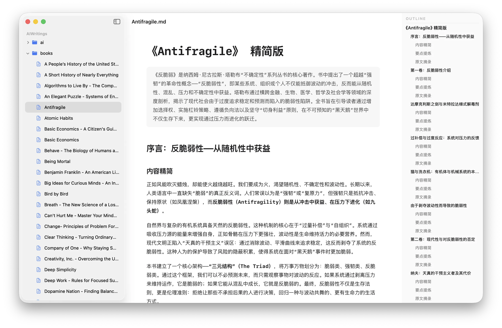

<p align="center">
  
</p>

<h1 align="center">Clearly</h1>

<p align="center">A native markdown editor for Mac.</p>

<p align="center">
  <a href="https://github.com/limboy/clearly/releases/latest/download/Clearly.dmg">Direct Download</a> &middot;
</p>

<p align="center">
  
</p>

Open a Markdown file or a folder workspace. Write with syntax highlighting. Toggle to preview. That's it. Native macOS, no Electron, no subscriptions, no telemetry.


This repository is forked from [Shpigford/clearly](https://github.com/Shpigford/clearly.git).

## Features

### Writing

- **Syntax highlighting** — headings, bold, italic, links, code blocks, tables, highlighted as you type
- **Format shortcuts** — ⌘B bold, ⌘I italic, ⌘K links, plus a full Format menu
- **Extended markdown** — ==highlights==, ^superscript^, ~subscript~, :emoji: shortcodes, wikilinks, `[TOC]` generation
- **Unified typography** — one font family and size setting for both the editor and preview
- **Document outline** — heading tree per document, click to jump
- **Find & replace** — ⌘F with regex and case-sensitive options
- **Scratchpad** — menu-bar floating notes with a global hotkey

### Files and workspaces

- **Standalone documents** — open individual Markdown files in native document windows
- **Folder workspaces** — browse a folder tree and edit its Markdown and text files in a single workspace window
- **Workspace file management** — create files and folders, copy paths, and reveal items in Finder from the sidebar
- **Autosave and restoration** — workspaces remember the folder, expanded directories, and active file; optionally reopen the last workspace at launch
- **External changes** — standalone documents automatically reload when another app updates them

### Preview

- **GFM rendering** — tables, task lists, footnotes, strikethrough
- **KaTeX math** — inline and block equations
- **Mermaid diagrams** — flowcharts, sequence diagrams from code blocks
- **Code blocks** — syntax-highlighted, line numbers, diff highlighting, one-click copy
- **Callouts** — NOTE, TIP, WARNING, and 15+ types, foldable
- **Interactive** — toggle checkboxes, zoom images, hover footnotes, double-click to jump to source

### Integration

- **QuickLook** — preview `.md` files in Finder with Space
- **PDF export** — export or print, page breaks handled

## Prerequisites

- **macOS 15** (Sequoia) or later for the Mac app
- **Xcode 16+** with command-line tools (`xcode-select --install`)
- **Homebrew** ([brew.sh](https://brew.sh))
- **xcodegen** — `brew install xcodegen`

Dependencies (cmark-gfm, Sparkle, KeyboardShortcuts) are pulled automatically by Xcode via Swift Package Manager.

## Quick Start

```bash
git clone https://github.com/limboy/clearly.git
cd clearly
brew install xcodegen    # skip if already installed
xcodegen generate        # generates Clearly.xcodeproj from project.yml
open Clearly.xcodeproj   # opens in Xcode
```

Then hit **⌘R** to build and run.

> The Xcode project is generated from `project.yml`. If you change `project.yml`, re-run `xcodegen generate`. Don't edit the `.xcodeproj` directly.

### CLI build

```bash
xcodebuild -scheme Clearly -configuration Debug build
```

## Project Structure

```
Clearly/
├── ClearlyApp.swift                # @main — document, workspace, settings, and scratchpad scenes
├── MarkdownDocument.swift          # FileDocument conformance for .md files
├── ContentView.swift               # Per-document scene root (Mac)
├── EditorView.swift                # NSViewRepresentable wrapping NSTextView
├── ClearlyTextView.swift           # Subclassed NSTextView with formatting actions
├── PreviewView.swift               # NSViewRepresentable wrapping WKWebView
├── WorkspaceManager.swift          # Folder access, tree refresh, selection, and autosave
├── WorkspaceView.swift             # Workspace sidebar + shared editor/preview surface
├── ScratchpadManager.swift         # Menu-bar floating scratchpad windows
└── SettingsView.swift              # General + About preferences

ClearlyQuickLook/
├── PreviewProvider.swift           # QLPreviewProvider for Finder previews
└── Info.plist

Packages/ClearlyCore/               # Local macOS SwiftPM package shared by app + QuickLook
└── Sources/ClearlyCore/
    ├── Rendering/                  # MarkdownRenderer, syntax highlighter, theme, mermaid/math/table support
    ├── State/                      # Document state, find/replace, outline, and workspace tree models
    ├── Editor/                     # ImagePasteService, ImageDownloader
    ├── Diagnostics/                # DiagnosticLog, BugReportURL
    ├── Stats/                      # MarkdownStats (word counts)
    └── Platform/                   # PlatformFont/Color/Image typealiases

Shared/Resources/                   # Bundled JS/CSS (KaTeX, Mermaid, Highlight.js), demo.md
scripts/                            # Release pipeline
project.yml                         # xcodegen config (source of truth)
```

## Architecture

**SwiftUI + AppKit**, with standalone document windows and an optional folder workspace window.

### Targets

1. **Clearly** — a `DocumentGroup` for standalone Markdown files plus a separate workspace `Window` for folder-based editing. Both use the same AppKit `NSTextView` editor and `WKWebView` preview bridged through `NSViewRepresentable`. The app also includes a menu-bar `MenuBarExtra` for floating scratchpads.
2. **ClearlyQuickLook** — Finder extension for previewing `.md` files with Space, sharing `MarkdownRenderer` from `ClearlyCore`.

### Editor

`ContentView` hosts the shared editing surface for both standalone documents and the active workspace file. It wraps `NSTextView` via `NSViewRepresentable`, providing native undo/redo and `NSTextStorageDelegate`-based syntax highlighting on every keystroke.

### Workspace

`WorkspaceManager` keeps security-scoped access to one folder, builds a bounded file tree, monitors it with FSEvents, and autosaves the active text buffer. `WorkspaceView` combines that tree with the existing editor, preview, outline, find, and export features without introducing a vault index or background content database.

### Preview

`PreviewView` wraps `WKWebView` and renders HTML via `MarkdownRenderer` (cmark-gfm). Post-processing pipeline: math → highlight marks → superscript/subscript → emoji → callouts → TOC → tables → code highlighting.

### Dependencies

| Package | Purpose |
|---------|---------|
| [cmark-gfm](https://github.com/brokenhandsio/cmark-gfm) | GitHub Flavored Markdown → HTML |
| [Sparkle](https://sparkle-project.org) | Auto-updates (direct distribution only) |
| [KeyboardShortcuts](https://github.com/sindresorhus/KeyboardShortcuts) | Global hotkey for the menu-bar scratchpad |

### Key Decisions

- **AppKit bridge** — `NSTextView` over `TextEditor` for undo, find, and `NSTextStorageDelegate` syntax highlighting
- **Two opening modes** — use `DocumentGroup` for standalone files and a dedicated scene for one folder workspace
- **Shared content surface** — standalone documents and workspaces reuse `ContentView` instead of maintaining separate editors
- **Dynamic theming** — all colors through `Theme.swift` with `NSColor(name:)` for automatic light/dark
- **Shared rendering** — `MarkdownRenderer` and `PreviewCSS` live in `ClearlyCore` and compile into the app and QuickLook
- **Dual distribution** — Sparkle for direct, App Store without. All Sparkle code wrapped in `#if canImport(Sparkle)`
- **No `.inspector()`** — outline panel uses `HStack` due to fullscreen safe area bugs

## Common Dev Tasks

### Change syntax highlighting

Edit `Packages/ClearlyCore/Sources/ClearlyCore/Rendering/MarkdownSyntaxHighlighter.swift`. Patterns are applied in order — code blocks first, then everything else.

### Modify preview styling

Edit `Packages/ClearlyCore/Sources/ClearlyCore/Rendering/PreviewCSS.swift`. Used by both in-app preview and QuickLook. Keep in sync with `Theme.swift` colors. Base styles must come before `@media (prefers-color-scheme: dark)` overrides.

### Add a preview feature

Follow the `MathSupport`/`MermaidSupport` pattern: create a `*Support.swift` enum in `ClearlyCore/Rendering/` with a static method that returns a `<script>` block. Integrate into `PreviewView.swift`, `PreviewProvider.swift`, and `PDFExporter.swift`.

## Testing

```bash
swift test --package-path Packages/ClearlyCore
```

Runs the rendering, find/replace, outline, workspace-tree, font-preference, and stats unit suites. UI code in `Clearly/` and `ClearlyQuickLook/` is verified by running the app, not unit-tested.

## License

FSL-1.1-MIT — see [LICENSE](LICENSE). Code converts to MIT after two years.
