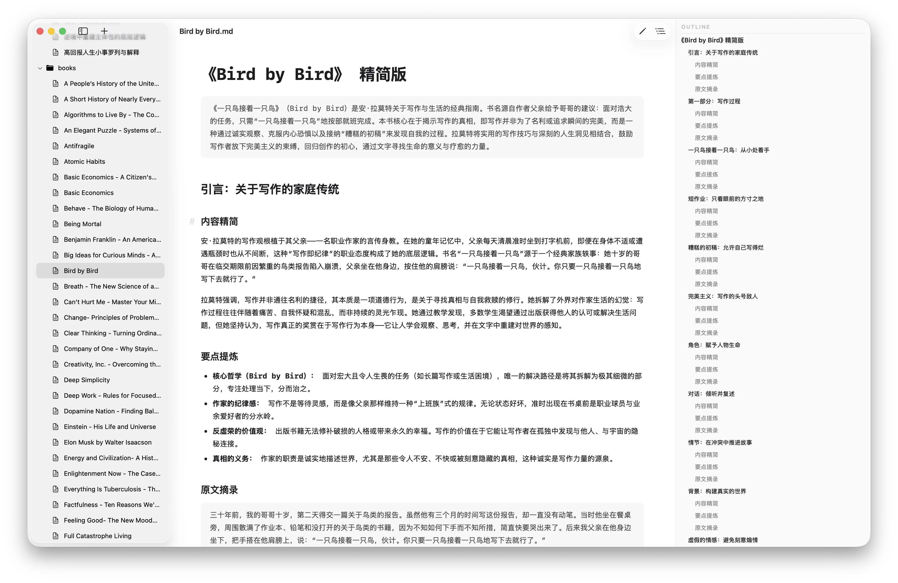

  

<h1 align="center">Clearly</h1>

A native markdown editor for Mac.

  <a href="https://github.com/limboy/clearly/releases/latest/download/Clearly.dmg">Direct Download</a>

  

Open a Markdown file or a folder workspace. Write with syntax highlighting. Toggle to preview. That's it. Native macOS, no Electron, no subscriptions, no telemetry.

> This repository is forked from [Shpigford/clearly](https://github.com/Shpigford/clearly.git).

## Features

- **Native & Fast** — Built with SwiftUI and AppKit. Light on resources with zero bloat.
- **Editor & Preview** — Real-time syntax highlighting in editor mode, full GFM rendering with KaTeX math and Mermaid diagrams in preview.
- **Folder Workspaces** — Open individual `.md` files or browse and manage entire folder structures in a single window.
- **macOS Integration** — Finder QuickLook support (preview `.md` files with Spacebar), menu-bar floating Scratchpad, and native PDF export.
- **Distraction-Free Writing** — Document outline navigation, find & replace, customizable typography, and dynamic light/dark theme support.

## Requirements

- macOS 15.0 (Sequoia) or later

## License

FSL-1.1-MIT — see [LICENSE](LICENSE).

